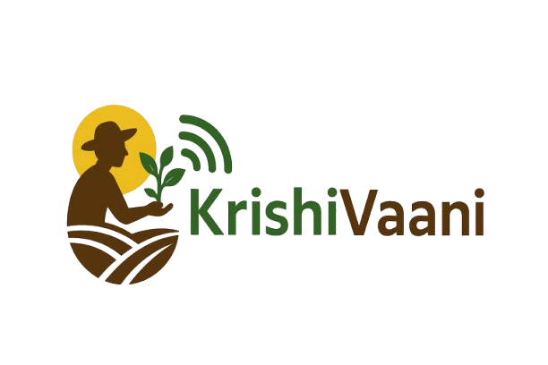

# KrishiVaani (AI) - A Modern Farmers' Portal 🌾

KrishiVaani is a comprehensive digital platform designed to empower farmers with modern tools, information, and resources to enhance their agricultural practices and improve their livelihoods.

## 🌟 Features

- **Weather Tracking**: Real-time weather updates and forecasts for better crop planning
- **Market Price Analysis**: Live market prices and price comparison tools
<!-- - **Agricultural Office Locator**: Interactive map to find nearby agricultural offices -->
- **Smart Farming Assistant**: AI-powered chat interface using Gemini for farming queries
<!-- - **Multi-language Support**: Accessible in multiple regional languages -->
- **Price Alerts**: Customizable notifications for market price changes
- **Farming Calculators**:
  - Fertilizer calculator for optimal usage
  - Revenue calculator for crop planning
- **Knowledge Hub**:
  - Informative blog posts
  - Crop calendars
  - Best practices guides
  - Government schemes information

## 🛠️ Tech Stack

- **Frontend**: Next.js 14, React, TypeScript
- **Styling**: Tailwind CSS, Shadcn UI
- **Database**: Supabase
- **AI Integration**: Google Gemini
  <!-- - **Maps**: Agricultural offices mapping -->
  <!-- - **Authentication**: Secure user management -->
- **Deployment**: Vercel

## 🚀 Live Demo

Visit [KrishiVaani](https://krishivaani.vercel.app/) to explore the platform.

## 🎯 Problem Statement

Indian farmers face numerous challenges:

- Limited access to real-time market information
- Difficulty in accessing government schemes
<!-- - Language barriers in accessing agricultural information -->
- Need for modern farming guidance
- Weather uncertainty affecting crop planning

KrishiVaani addresses these challenges by providing a unified, accessible platform with all necessary tools and information.

## 💡 Solution

KrishiVaani serves as a one-stop solution for farmers by:

- Providing real-time market data and price alerts
<!-- - Offering multilingual support for better accessibility -->
- Integrating AI for personalized farming advice
- Creating an informative knowledge base
- Simplifying access to government schemes
- Offering practical calculators for farming operations

## 🌐 Accessibility Features

<!-- - Multi-language support
- High contrast mode -->

- Screen reader compatibility
- Responsive design for all devices
- Easy navigation and user-friendly interface

## 🏗️ Future Roadmap

- Multi-language support
- Mobile app development
- Integration with IoT devices for field monitoring
- Community features for farmer networking
- Crop disease detection using AI
- Integration with e-commerce platforms for direct selling

## 👥 Team

Created with ❤️ for farmers by **TechGramin Innovators**

---

Made with 💻 for **HACK4BENGAL** 2025
